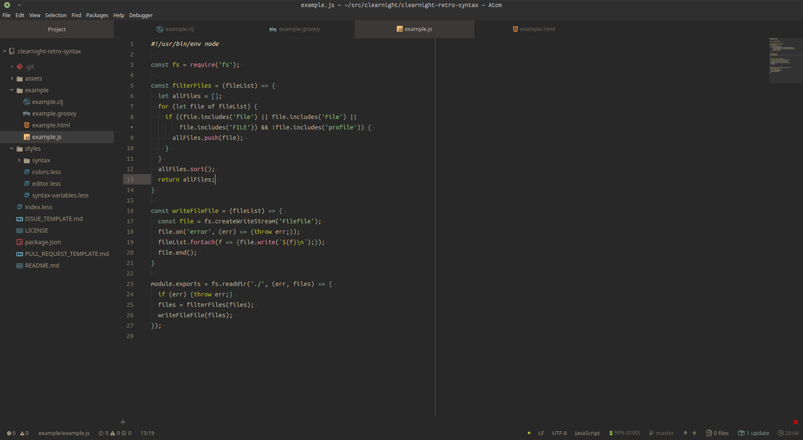

<p align="center"></p>

Syntax theme for Atom inspired by the soothing colors of the night sky. Designed for use with [Clear Night UI](https://atom.io/packages/clear-night-syntax).

Clear Night Syntax is based on [Solarized Dark Syntax](https://github.com/atom/solarized-dark-syntax)

# Preview

<p align="center"></p>

> Icons provided by [File Icons](https://atom.io/packages/file-icons), shown with [Clear Night UI](https://atom.io/packages/clear-night-ui) and [Minimap](https://atom.io/packages/minimap).

## Getting started
### Installation
** [apm](https://github.com/atom/apm)**  
```shell
apm install clear-night-syntax
```

** [Atom](https://atom.io)**  
  1. Open *Settings > Install*
  2. Set the filter to *Themes*
  3. Search for `clear-night-syntax` and install

**Activation**
  1. Open *Settings > Themes*
  2. Select `Clear Night` from the *Syntax Theme* drop-down menu

### Contribution
Please report issues/bugs, feature requests and suggestions for improvements to the [issue tracker](https://github.com/raindeer44/clear-night-syntax/issues).


---


<p align="center"><a href="https://github.com/raindeer44/clear-night-syntax/LICENSE">Copyright &copy; 2017 Jade Thornton</a></p>

<p align="center"><a href="https://github.com/raindeer44/clear-night-syntax/LICENSE"></a></p>
